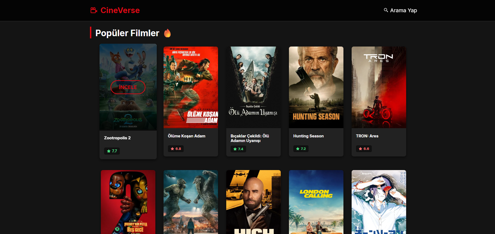

# 🎬 CineVerse - Ultimate Movie Discovery App

**CineVerse** is a professional-grade, Netflix-inspired movie discovery application built with **React**.
It leverages the **TMDB API** to provide real-time data, featuring a modern dark UI, dynamic search functionality, and immersive movie detail pages.


_(Note: You can replace this link with a real screenshot of your app later!)_

## ✨ Key Features

- **🔥 Trending Movies:** Displays the latest popular movies in real-time.
- **🔍 Dynamic Search Engine:** Instantly search for any movie from the massive TMDB archive.
- **📄 Immersive Details:** Dedicated movie pages with high-quality backdrops, posters, ratings, and plot summaries.
- **🎨 Modern UI/UX:** Fully responsive design, dark theme, and glassmorphism effects.
- **⚡ Fast & Smooth:** Optimized performance using Vite and Axios.

## 🛠️ Tech Stack

- **Frontend:** React.js (Vite)
- **Routing:** React Router DOM v6
- **HTTP Client:** Axios
- **Styling:** CSS3 (Grid, Flexbox, Variables)
- **Icons:** React Icons
- **API:** The Movie Database (TMDB)

## 🚀 How to Run Locally

This project requires a TMDB API Key (Free).

1.  **Clone the repository**

    ```bash
    git clone [https://github.com/1nkeeper/cine-verse.git](https://github.com/1nkeeper/cine-verse.git)
    cd cine-verse
    ```

2.  **Install Dependencies**

    ```bash
    npm install
    ```

3.  **Configure API Key**

    - Open `src/pages/Home.jsx` and `src/pages/Search.jsx` and `src/pages/MovieDetail.jsx`.
    - Replace `API_KEY` with your own API Key from TMDB.

4.  **Run the App**
    ```bash
    npm run dev
    ```

---

## 👨‍💻 Author

Developed by **[Eren Tüzün](https://github.com/1nkeeper)**.
_Showcasing modern React development skills._

---

**🎬 Enjoy exploring movies with CineVerse!** 🍿


